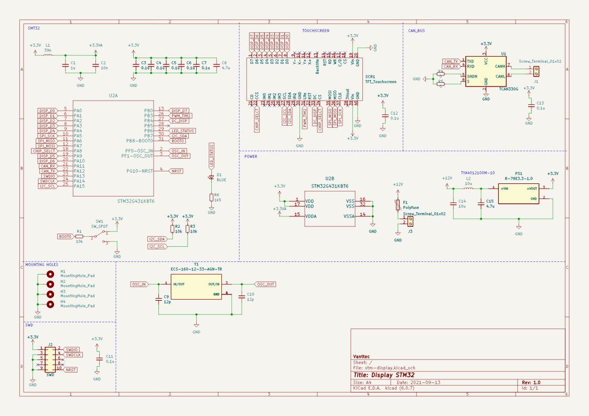
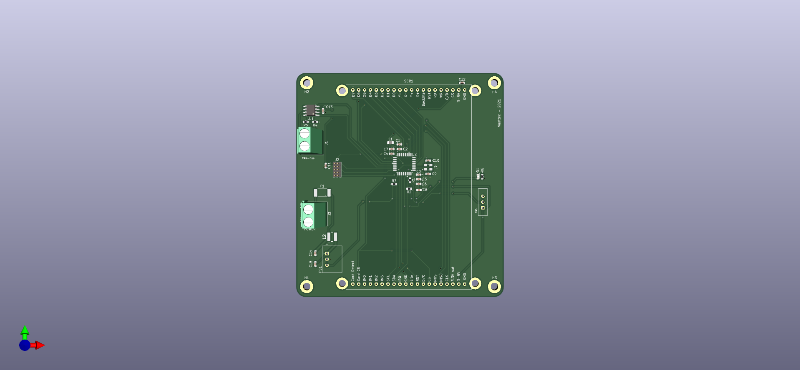

This is a 2-layer PCB designed as a complementary device for our team in order to get information more easily about the status of the vehicle, such as sensors or battery power percentage.

### Components Used
- STM32G431KBT6
- Adafruit 2.8" and 3.2" Color TFT Touchscreen
- ECS-160-12-33-AGN-TR - > 16 MHz Crystal
- R-78E3.3-1.0 -> Regulator
- TCAN330G -> 3.3V CAN Transceiver

### Notes
The display can be connected using either I2C or SPI communication protocol.
The microcontroller uses the CAN protocol to receive info and data from another device.

### Schematic 

### Front View
